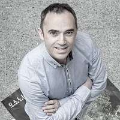

# Artigos

## Artigos

## [Analytics, Free Data e outras Networks](analytics-free-data-e-outras-networks.md)

Como xestionar os nosos datos para facelos máis accesibles e útiles

## [Cartografía participativa: OpenStreetMap](cartografia-participativa-openstreetmap.md)

Historia e evolución da cartografía participativa

## [Xornada de presentación de software con licenza libre para uso científico](xornada-de-presentacion-de-software-con-licenza-libre-para-uso-cientifico.md)

O obxectivo principal desta actividade foi o de compartir coñecementos e experiencias arredor do Software Libre de uso Científico, así como presentar a versión 5.0 de EpiLinux.  

## [Os proxectos Wikimedia](os-proxectos-wikimedia.md)

Amais da Wikipedia, hai outros proxectos irmáns, todos eles baixo o amparo da Fundación Wikimedia

## [Edición profesional de son con Linux](edicion-profesional-de-son-con-linux.md)

Hydrogen. Un secuenciador profesional de batería, multiplataforma e de licenza libre

## [As Administración Públicas que favorecen uns salarios mediocres](a-aapp-que-favorece-uns-salarios-mediocres.md)

Participar nun concurso non é tema baladí para aquelas que se inician nestes trámites. Solicítase información de todo tipo, como é lóxico, en referencia á solvencia técnica e económica.

## [**Persoas que difunden a cultura libre, Francisco Estrada**](persoas-que-difunden-a-cultura-libre-francisco-estrada.md)

Serie de artigos para dar a coñecer a individuos e colectivos, que axudan na difusión ou colaboran de forma significativa na cultura libre.

## [root ou non root? Esa é a cuestión…](root-ou-non-root-esa-e-a-cuestion....md)

**Laboratorio Android**  
\(parafraseando a Hamlet, -acto terceiro, escena primeira- de W. Shakespeare\)

## [O ecosistema de OpenStreetMap](o-ecosistema-de-openstreetmap.md)

Que é e que non é OSM?

## [Debuxos libres](debuxos-libres.md)

Debuxos liberados pola autora baixo licenzas libres Creative Commons

## [Fotografías libres](fotografias-libres.md)

Fotos liberadas polo autor baixo licenzas libres Creative Commons

## [Colaboradores](colaboradores.md)

