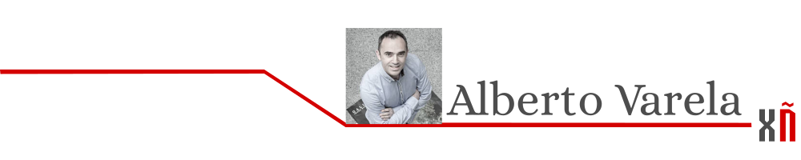
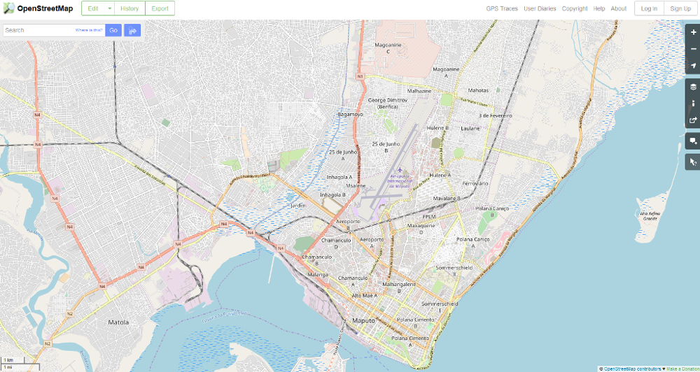

# Cartografía participativa: OpenStreetMap

## Cartografía participativa: OpenStreetMap

A sociedade da información incorporou nas últimas décadas o compoñente xeográfico dos datos á vida cotiá. A cartografía deixou de ser un elemento de campos profesionais ou científicas, con pouca presenza na actividade dos cidadáns, para se converter nunha ferramenta líder para o público en xeral, e esencial para as administracións e moitas empresas.  
  
O propio desenvolvemento da cartografía deixou de ser un dominio exclusivo de profesionais e expertos do sector, para ser unha tarefa abertas grazas as novas tecnoloxías que permiten aos usuarios desenvolver e compartir información de cartografía de forma colaborativa, como o proxecto OpenStreetMap \(OSM\).

  
 O funcionamento da cartografía participativa ou colaborativo remóntase á orixe mesmo da elaboración dos mapas, onde os viaxeiros e exploradores foron axudados polos pobos indíxenas para trazar mapas e rutas a través dunha rexión.  
  
Trátase polo tanto dunha combinación do coñecemento local, coa base da participación directa dos habitantes dun lugar, coas tecnoloxías que crean e representan información xeográfica dun área para un propósito particular, e que durante séculos teñen necesitado de especialistas en cartografía para poder elaborarse cun certo rigor.  
  
A obra "O xeógrafo" [https://es.wikipedia.org/wiki/El\_ge%C3%B3grafo\_\(Vermeer\)](https://es.wikipedia.org/wiki/El_ge%C3%B3grafo_%28Vermeer%29) do pintor holandés Johannes Vemeer século XVII, reflicte con gran beleza esa necesidade de dipoñer dunha iluminación científica e dunha instrumentación complexa para poder construír un mapa.

FOTOGRAFÍA:  
 [https://es.wikipedia.org/wiki/El\_ge%C3%B3grafo\_\(Vermeer\)\#/media/File:J.\_VERMEER\_-\_El\_ge%C3%B3grafo\_\(Museo\_St%C3%A4del,\_Fr%C3%A1ncfort\_del\_Meno,\_1669\).jpg](https://es.wikipedia.org/wiki/El_ge%C3%B3grafo_%28Vermeer%29#/media/File:J._VERMEER_-_El_ge%C3%B3grafo_%28Museo_St%C3%A4del,_Fr%C3%A1ncfort_del_Meno,_1669%29.jpg)

J. VERMEER - O xeógrafo \(Museo Städel, Frankfurt am Main, 1669\)  
  
Sen embargo, as técnicas informáticas, xunto cos avances nas tecnoloxías de información e comunicación, e as capacidades que ofrecen as técnicas de captura e procesamento da información xeográfica, revolucionan o proceso de creación de cartografía. Hoxe simplemente cun teléfono con conexión a Internet, calquera con coñecementos básicos ou unhas simples indicacións, é capaz de participar na creación de cartografía de precisión en calquera rexión do mundo, como evidencia o proxecto colaborativo OpenStreetMap para crear mapas libres e editables.  
  
OSM pódese definir como un movemento mundial para crear e compartir información xeográfica de xeito voluntario e aberto. É unha iniciativa lanzada en 2004 polo entonces estudante de informática Steve Coast, para evitar os altos prezos para usar a cartografía de Gran Bretaña.  
  
Aínda que as tendencias están cambiando, e máis no ámbito europeo pola Directiva INSPIRE \(Infraestrutura de información xeográfica en Europa\) [http://www.idee.es/europeo-inspire](http://www.idee.es/europeo-inspire) adoptada polo Parlamento Europeo en 2007, na a maioría dos países do mundo, a información xeográfica moitas veces non é libre para usarse de calquer xeito, e mesmo se o usuario paga para o seu desenvolvemento a través de impostos, moitas veces debe \(por sorte cada vez menos\) pagar tamén a súa adquisición.  
  
Ademáis, as licenzas de uso normalmente condicionan e limitan o seu emprego, o que pode representar conflitos en moitas ocasións.  
  
 OSM cambiar esta situación, xa que son os propios usuarios os que crean e corrixen os datos vectoriais dos mapas mediante ferramentas de edición [https://wiki.openstreetmap.org/wiki/Editors](https://wiki.openstreetmap.org/wiki/Editors) , cas que se dixitalizan directamente sobre ortofotos ou outras fontes cartográficas, ou ben usando a información capturada con dispositivos GPS.   
  
Actualmente, o proxecto ten máis de 4.500.000 de usuarios rexistrados, crecendo a un ritmo mensual espectacular, e con grupos de usuarios en todo o mundo, que xeneran máis de 80 millóns de edicións de datos cada mes, e teñen unha cita anual para avaliar o State of the Map [https://eg.stateofthemap.org/](https://eg.stateofthemap.org/) .  
  
O feito de que na maioría dos casos o único interese para cargar información, é a voluntade dos usuarios, sen considerar as cuestións comerciais de outras iniciativas empresariais, fai que OSM teña información de lugares en calquera lugar do mundo, sen importar o poboado que sexa.

Captura do mapa de Maputo \(Mozambique\) en OpenStreetMap el 15/06/2018 [https://www.openstreetmap.org/\#map=13/-25.9204/32.5619](https://www.openstreetmap.org/#map=13/-25.9204/32.5619)

Unha das accións máis interesantes de OSM é o seu uso en proxectos de cooperación para o desenvolvemento, e especialmente nas emerxencias humanitarias. Tanto é así que hai un grupo específico chamado HOT \(Team OpenStreetMap Humanitaria\) [https://www.hotosm.org/](https://www.hotosm.org/) responsable da coordinación das tarefas de cartografiado en situacións de desastres naturais que requiren accións humanitarias urxentes, conseguindo ofrecer en poucas horas ou días, unha nova cartografía deses lugares, o que axuda enormemente aos equipos de emerxencia na xestión destas operacións.

A principal fortaleza de OSM é que os seus datos cartográficos distribúense baixo unha licenza aberta [https://www.openstreetmap.org/copyright](https://www.openstreetmap.org/copyright) , polo que a partir dos seus elementos, non só calquera cun navegador web pode visualizar e consultar mapas actualizados [https://wiki.openstreetmap.org/wiki/ES:Navegaci%C3%B3n](https://wiki.openstreetmap.org/wiki/ES:Navegaci%C3%B3n) , senon que tamén pode usar estes datos para crear novos mapas e facer análises en numerosos ámbitos.  
  
A medida que o proxecto OSM madurou, e a súa base de datos mellorou en calidade e cobertura, foron xurdindo en torno a el, todo un ecosistema de ferramentas e servizos que dan aínda máis valor a este proxecto [https://wiki.openstreetmap.org/wiki/List\_of\_OSM-based\_services](https://wiki.openstreetmap.org/wiki/List_of_OSM-based_services) .

Esta fortaleza de OSM pode ser encadrado dentro da nova tendencia ou fenómeno social chamado neoxeografia, derivado do novo uso masivo que ten a cartografía en Internet. As novas tecnoloxías de información ofrecen libertade de acceso á xeorreferenciación de lugares e a xeoetiquetación de contidos, grazas ao aumento do uso cotián do GPS e dispositivos que permiten o posicionamento a través das redes de comunicación.  
  
A facilidade de integración de novos recursos en entornos web usando APIs consegue que calquera poida publicar información directamente en función dos seus intereses e criterios espaciais, temporais, creativos e/ou comprometidos con algunha causa territorial ou social.  
  
Neste sentido, estas ferramentas abren o camiño para un novo desenvolvemento tecnolóxico que dende o CartoLab-UDC estamos intentando promover e potenciar coa creación de novos servizos e aplicacións.  
  
Pero diso falaremos noutra ocasión.

## [Seguinte artigo](xornada-de-presentacion-de-software-con-licenza-libre-para-uso-cientifico.md)

