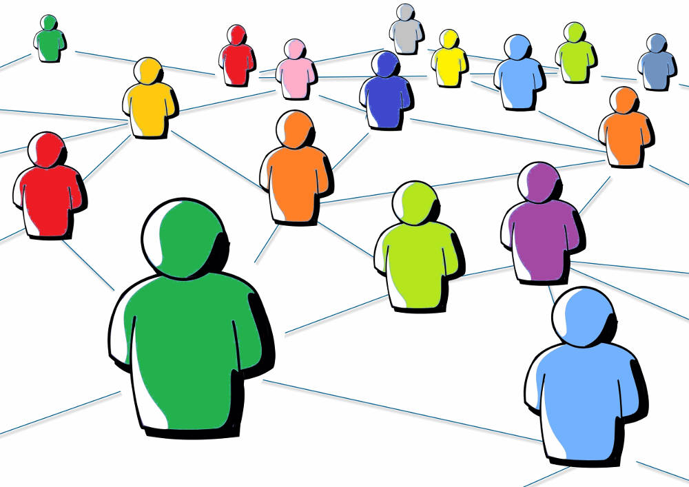

# O ecosistema de OpenStreetMap

## O ecosistema de OpenStreetMap

Que é e que non é OSM? Esta é sempre unha das preguntas ou reflexións que plantexo nas charlas sobre [OpenStreetMap](http://openstreetmap.org) e a través da que sempre explico que OSM non é un mapa. Isto soe chocar bastante xa que cando un entra na web oficial o primeiro que ve é un mapa, e ademais unha das formas máis sinxelas de explicar que é OSM para os máis profanos é comparalo con _Google Maps_.

Porén OpenStreetMap non é un mapa senón unha base de datos que contén información coa que entre outras cousas podemos facer mapas. Isto, que ao principio pode soar como difícil de entender, é no fondo moi sinxelo.  
A principal diferencia co servizo de Google é que a pesar de que o que vemos é un mapa, a base de datos que hai por detrás, é libre e aberta para uso e mellora por parte de todo o mundo. Cando un consulta como usuario o servizo de _Google Maps_, o que atopa é un mapa deseñado por Google, con información capturada, organizada, deseñada e feita pola compañía de Mountain View. Nós como usuarios deste servizo podemos consultar o mapa, pero non podemos acceder á información que hai detrás.

Entón, cando poño no navegador _www.openstreetmap.org_ que é o que estou a ver, porque eu xuraría que vexo un mapa, non é? Pois efectivamente ávido lector, nesa _url_, punto de entrada ao proxecto OpenStreetMap hai un mapa.  
Este servizo é provisto pola _OpenStreetMap Foundation_, a organización sen ánimo de lucro que está detrás do proxecto e que canaliza todas as contribucións da comunidade. Este servizo ademais de mostrar un mapa do mundo creado coa información que contén a base de datos de OSM, é o punto de partida tamén para poder colaborar co proxecto, editando a cartografía e os datos.  
Porén, nesta _url_ non está toda a información que contén OSM, xa que mostrala toda nun único mapa sería imposible.

Vale, vale, OSM non é un mapa, é unha base de datos, moi ben, pero entón... isto do ecosistema de OpenStreetMap que vén sendo?. A día de hoxe en OpenStreetMap hai máis de 3 millóns de usuarios rexistrados, que colaboran mellorando a base de datos coas súas contribucións.  
Dentro destes usuarios hai dende xente particular a organismos públicos e privados, administracións, asociacións ou empresas. A distintos niveis todas elas colaboran cun mesmo fin común que é o de alcanzar unha información cartográfica libre que cubra todo o mundo.  
Os diferentes intereses que pode haber detrás de cada tipo de entidade misturanse de tal xeito que en pouco máis de dez anos o proxecto medrou de xeito espectacular.

A día de hoxe OpenStreetMap é unha alternativa fiable de datos cartográficos, que ofrece unha gran cantidade de información en bruto, pero que tamén ofrece moitas ferramentas, tecnoloxías e servizos que foron nacendo ao redor do proxecto.  
As tecnoloxías que se empregan por exemplo para a visualización dos datos, converténdoos nun mapa sobre o que podemos navegar, as ferramentas que temos á nosa disposición para melloralo, editando estradas, edificios, parques ou calquera outro elemento, ferramentas para importar información dende outras fontes á OSM, mesmo ferramentas de validación dos datos ou para crear copias da base de datos que poidamos empregar de xeito particular para proxectos propios, son todas elas consecuencia do ecosistema que naceu ao redor do proxecto.

É unha característica fundamental dos proxectos de software libre nos que ao haber un punto común de interese, totalmente aberto nas mesmas condicións para todo mundo, sexa o código fonte dunha tecnoloxía ou un conxunto de datos, se forma sempre un, chamemoslle ecosistema, chamemoslle comunidade que a partir dun interese común se retroalimenta, colabora e medra conxuntamente.

Ademais do traballo netamente voluntario por parte de xente particular que se sinte atraída pola filosofía do proxecto e que dedica o seu tempo libre a melloralo, é necesario para que un proxecto colaborativo teña éxito que outro tipo de actores participen no mesmo, colaboren a melloralo no beneficio de todos e o empreguen para os seus fins particulares. É a creación deste tecido ao redor do proxecto, deste ecosistema o que marca a diferenza para o éxito dos proxectos.

En palabras de _Valdis Krebs_: **"Connect on your similarities. Profit from your differences."**

Que diferentes entidades empreguen, e así o están facendo cada vez máis, datos de OpenStreetMap para os seus proxectos non fará senón que mellorar cada vez máis a base de datos e as tecnoloxías que están ao redor, o que a súa vez contribuirá a que máis entidades se acheguen a OSM e o empreguen como fonte principal de información.

## [Seguinte artigo](debuxos-libres.md)

