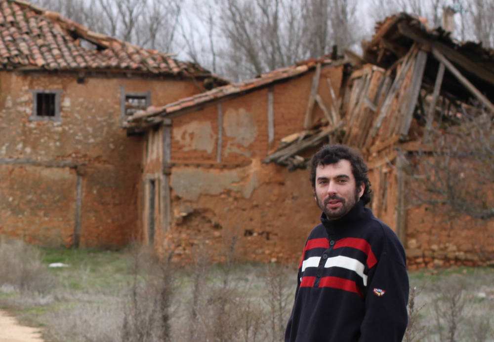

# Os proxectos Wikimedia

## Os proxectos Wikimedia

[Wikipedia](https://es.wikipedia.org/wiki/Wikipedia:Portada) é unha enciclopedia colaborativa. Actualmente hai Wikipedia en 288 linguas. É un dos sitios web máis visitados en todo o mundo \(agás en Turquía, onde está prohibido o seu acceso desde abril de 2017!\), e énos ben útil cando queremos coñecer algún dato puntual. O seu uso tamén ten grande impacto no campo educativo, xa sexa desde o ensino primario até a Universidade.

É colaborativa porque os seus contidos están desenvolvidos por persoas voluntarias. Unha das principais eivas a este respecto é que só un 15 % das persoas que colaboran son mulleres, polo que hai unha certa fenda de xénero nos contidos.

Amais da Wikipedia, hai outros proxectos irmáns, todos eles baixo o amparo da Fundación Wikimedia.  
Desde o [Wiktionary](https://www.wiktionary.org/) \(con definicións léxicas\) ao [Wikiquotes](https://es.wikiquote.org/wiki/Portada) \(con citas\) pasando polo [Wikisources](https://es.wikisource.org/wiki/Portada) \(fontes documentais escritas\), [Wikinews](https://www.wikinews.org/) \(noticias\) ou [Wikivoyages](https://www.wikivoyage.org/) \(unha especie de guías turísticas\).

Mais por riba destes hai dous proxectos moi importantes, que serven de respaldo a Wikipedia e que teñen unha existencia máis silenciosa: [**Wikidata**](https://www.wikidata.org/wiki/Wikidata:Main_Page) e [**Commons**](https://commons.wikimedia.org/wiki/Main_Page).

### Commons

Commons é o repositorio de documentos audiovisuais. En xuño de 2018 tiña 47 millóns de arquivos, principalmente fotografías, pero tamén vídeos, arquivos de son, ou ilustracións.  
En boa medida as imaxes están categorizadas de forma xerárquica, o que facilita a súa busca. Amais, procúrase que as imaxes estean xeolocalizadas.  
Hai certos criterios de calidade, e realízanse concursos para escoller as mellores fotos. Así como na Wikipedia é posible editar de forma anónima, para cargar arquivos en Commons é preciso ter creada unha conta de usuario ou usuaria. Pode escollerse un nick calquera, claro, pero é importante ter unha conta para citar a autoría cando se lle dá uso ás fotos.  
Cada persoa escolle a licenza con que sube as súas propias imaxes \(eu utilizo a CC-4.0, pero é cuestión de gustos\).  
Por suposto, poden subirse tamén imaxes que estean no dominio público, como fotos antigas.

### Wikidata

Wikidata, pola súa banda, é unha base de datos documental que acolle ítems para cada concepto, xa sexa unha persoa, un río, un libro, ou unha corrente filosófica. A cada ítem asígnanselle determinadas afirmacións: poboación nun determinado ano, número atómico, data de nacemento, ISBN etc. Amais, poden cruzarse datos con outras bases como IMDb ou dialnet, por poñer dous exemplos. Podería dicirse que se en Wikipedia hai artigos cunha redacción enciclopédica e unha información estruturada, Wikidata é un frío repositorio de datos.

### Para que serve Wikidata?

Pois por un lado para actualizar información na Wikipedia de forma máis cómoda, pois como esta pode tomar algúns datos daquela, se poñemos un dato novo en Wikidata é factible que a Wikipedia se actualice de forma automática. Á parte, permite cruzar datos para levar a cabo estudos estatísticos. Por exemplo: cantas mulleres \(con ítem en Wikidata, claro!\) nadas na provincia de Pontevedra estudaron na Universidade de Santiago entre 1900 e 1950? Ou cantos futbolistas islandeses xogaron en equipos do País Vasco?

Wikidata e Commons tamén están relacionados entre eles. Así, se a unha parroquia do concello de Curtis lle asigno en Wikidata unha foto que subín a Commons, esa foto aparece directamente en todas as Wikipedias que teñan artigo sobre esa parroquia e que usen o modelo determinado. O mesmo pasa con persoas, grupos de música, etc.

De cara ao futuro estase estudando a posibilidade de que Wiktionary se pase a Wikidata. Eu son partidario: a cada ítem léxico asígnaselle en cada lingua unha definición, unha etimoloxía, relación con homónimos e sinónimos e o que cumpra. Wikidata tamén está a acabar co proxecto Wikispecies, pois a cada forma de vida se lle asigna o correspondente reino, filo, clase, orde, familia e xénero. Os taxons están relacionados con cadanseu artigo enciclopédico na Wikipedia, e coa correspondente categoría de imaxes en Commons.

En Commons xa se están a subir numerosas imaxes en 3D e fotografías en 360º.

### E cal é o futuro?

De momento só son divagacións, pero se cadra dentro duns anos poderían subirse olfactos, por exemplo, se houbese dispositivos que permitisen codificalos e despois reproducilos. Por que non?

Algo que xa está moi estendido nos proxectos Wikimedia é o uso de bots. Son facilmente programables para levar a cabo edicións masivas: desde categorizacións de imaxes, a correccións ortográficas ou actualizacións de información.

Se cadra poderemos falar deles noutro artigo!

## [Seguinte artigo](edicion-profesional-de-son-con-linux.md)

