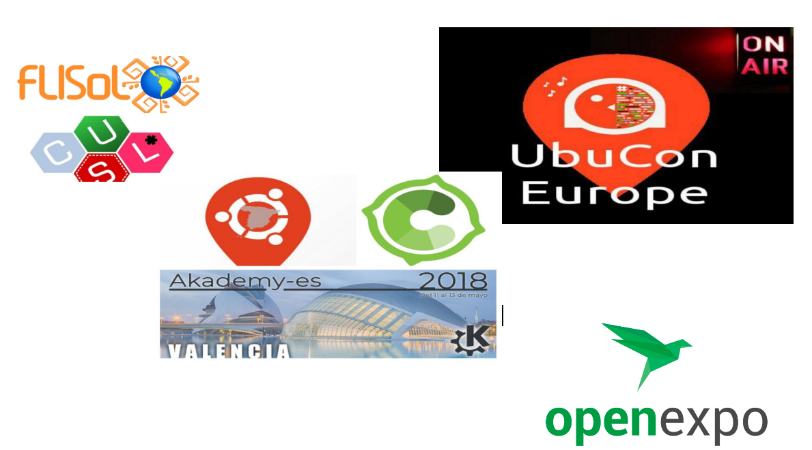

# Persoas que difunden a cultura libre, Francisco Estrada

## Persoas que difunden a cultura libre, Francisco Estrada

Neste caso falamos doutro podcaster, Francisco Estrada, máis coñecido como Paco Estrada.

### Podcasting – “ Compilando Podcast”

[Compilando Podcast](https://compilando.audio/), foi recentemente un dos gañadores do [**Open Awards 2018**](https://openexpoeurope.com/es/ganadores-open-awards-2018/) na categoría de **Mellor medio ou blog**. Noraboa, Paco!

Paco Estrada define o seu programa deste xeito:

Un programa dedicado a GNU/linux e Sotfware Libre. Persoas e cousas que destacan dentro do mundo do software libre e noticias comentadas da actualidade deste mundo.

Non sei que ferramentas de compilación utiliza Paco para xestar o seu podcast, chamado “Compilando Podcast” \(seguramente CCG porque é un apaixonado de gnu/linux\) pero o resultado son uns programas moi interesantes, sen bugs de ningún tipo e optimizados a tope para a sua audiencia.

Cando escoitas a Paco, nótaslle o seu paso pola radio profesional. Posúe unha voz ben adestrada e unha cabeza ben amoblada, preparada para levar a bo porto as entrevistas que nos brinda nos seus programas \(e podo falar do seu bo facer porque o vin [entrevistando en vivo e en directo á xente de NOlegaltech Radio](http://www.ivoox.com/crossover-entre-acompilanpodcast-nolegatech-radio-audios-mp3_rf_22011774_1.html)\).

Realiza un labor de difusión impagable. É moi recomendable escoitar o seu podcast para poder estar ao tanto dos grandes eventos españois relacionado co mundo do software libre, como veu deixando constancia disto estes últimos anos falándonos da Akademy 2017, OpenExpo 17, Librecon 2017, Ubucon Europe 2018 \(todo un maratón de fondo foi este último\), Flisol 2018 e outros eventos que chegarán este ano.

Nos seus programas atopamos entrevistas nas que non se esquece de falar do humano, onde toca tamén a parte técnica que tanto nos gusta aos apaixonados deste mundo. Estas entrevistas nótanse que foron preparadas a fondo, con tempo e agarimo pola materia, charlando con desenvolvedores ou persoas relacionadas con importantes proxectos como KDE, Gnome, Fundación Apache, Agasol, Red Hat, Fedora e Debian entre outros.

Paco forma parte de varios proxectos colaborativos podcasteros:

Maratón Linuxero [https://maratonlinuxero.org](https://maratonlinuxero.org/)/ e Killall Radio [https://killallradio.com/](https://killallradio.com/) \(2 proxectos moi interesantes dos que falaremos en futuras ocasións\).

Podes atopar os programas de Compilando Podcast aloxados na súa páxina web:

[https://compilando.audio/](https://compilando.audio/)

ou na plataforma de podcasting ivoox:

[https://www.ivoox.com/podcast- compilando- podcast\_ sq\_ f1388684\_1.html](https://www.ivoox.com/podcast-compilando-podcast_sq_f1388684_1.html)

### Canle de YouTube

Compilando Podcast dispón tamén dunha canle de YouTube, para aqueles que prefiran acceder aos seus programas a través desta plataforma:

[https://www.youtube.com/channel/ucr4 lDlQzgOkbtttgQQnDorw](https://www.youtube.com/channel/UCr4lDlQzgOkbtttgQQnDorw)

Todos os programas teñen información interesante, pero vou destacar dous dos meus favoritos:

- Podcast 18 – Desenvolvemento de Debian con Laura Arjona e Firefox Quantum

[https://www.youtube.com/watch?v= BMsDomkbIK4](https://www.youtube.com/watch?v=BMsDomkbIK4)

e o programa colaborativo entre Compilando Podcast e Nolegaltech Radio no que tiven o pracer de participar:

- Podcast 16 – Resumo LibreCon 2017 e Crossover NoLegalTech Radio

[https://www.youtube.com/watch?v= LWqcu3 YkNvg](https://www.youtube.com/watch?v=LWqcu3YkNvg)

Na súa canle persoal, Paco ten colgado un interesante tutorial sobre Jack \(tema que tamén nos gusta por aquí e tratamos no número 00 de Xeración Ñu\):

[https://novuslinux.wordpress. com/2017/01/31/ introduccion-a- jack-e- cadence- produccion-de-son-en- gnulinux/](https://novuslinux.wordpress.com/2017/01/31/introduccion-a-jack-y-cadence-produccion-de-sonido-en-gnulinux/)

### Canle de Telegram

Se queres estar ao tanto das publicacións de Paco Estrada, podes facelo a través desta canle:

[https://t.me/compilandopodcast](https://t.me/compilandopodcast)

### Ligazóns de interese

Web

[https://compilando.audio/](https://compilando.audio/)

Twitter

[https://twitter.com/CompilanPodcast](https://twitter.com/CompilanPodcast)

Se queres saber máis sobre este gran comunicador, podes escoitar varias entrevistas que lle fixeron en diferentes medios:

- Entrevista doutro gran podcaster, [Yoyo Fernández](https://twitter.com/yoyo308), a Paco Estrada no seu programa Salmorejo Geek [https://salmorejogeek.com/](https://salmorejogeek.com/):

[https://novuslinux.wordpress.com/2016/11/28/entrevista-en-salmorejo-geek/](https://novuslinux.wordpress.com/2016/11/28/entrevista-en-salmorejo-geek/)

- Entrevista a Paco Estrada para radioteca:

[https://radioteca.net/audioseries/entrevista-a- paco- estrada- compilando-podcast/](https://radioteca.net/audioseries/entrevista-a-paco-estrada-compilando-podcast/)

### Petición para Paco

E xa para rematar, deixo aquí unha petición para Paco: gustaríame que nun dos seus programas de Compilando Podcast falase a fondo sobre as novidades dos simuladores de voo libres para GNU/Linux, aos que é afeccionado, como FlightGear.

Artigo de Jorge Lama para Xeración \*Ñu – 01, publicado baixo licenza Creative Commons BY-SA 4.0

## Seguinte artigo

